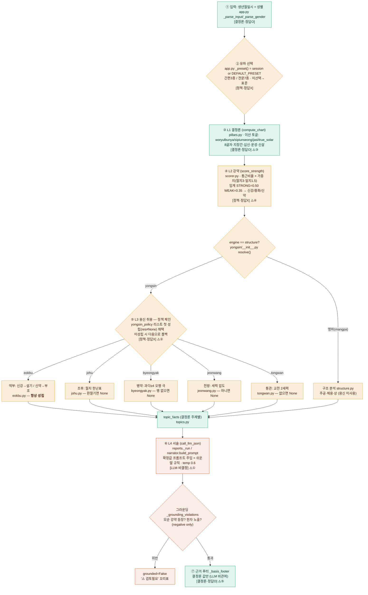

# 해석 파이프라인 논리성 감사 (Interpretation Pipeline Audit)

> **목적**: "유파를 찾아 해석에 이르는 전 과정"을 **논리성 기준으로 비판적으로 감사**하고, 그 결과를 **가시화 + 논리화**하여 후속 작업(개선 구현)으로 이관한다.
> **작성**: 2026-06-22 · **상태**: 분석 완료 / 개선 미구현 · **범위**: `engine/` L1~L4 + `app.py` 유파 선택 UX
> **핵심 근거**: 본 문서의 모든 주장은 코드 직접 확인분이며 `파일:줄`로 표기. 라인 번호는 감사 시점 기준(파일이 활발히 변경 중이므로 **심볼명 우선** 참조 권장).

---

## 0. TL;DR (한 줄 결론)

**L1 결정론(천문 oracle·교차검증)과 trace 계약은 견고하다. 그러나 사용자가 실제로 읽는 L4 리포트까지 가는 논리 사슬이 세 곳에서 끊긴다:** (1) L2 강약 임계값이 출처 없는 상수라 분기가 임의적이고(④), (2) L3 용신 폴백이 사실상 "억부 안전망"이라 유파 선택의 실효가 약하며(②), (3) L4 그라운딩이 negative check뿐이라 비결정 생성물이 결정론의 권위를 입는다(①). 결정적으로, **"계산은 정답이 있다"는 명제를 내세우면서도 유파 토글이 원국(지장간·운성)을 바꾸는 사실을 UI가 "강조점 차이"로 축소·은폐**(③)해 제품의 신뢰 기반과 사용자 안내가 어긋나 있다.

---

## 1. 배경 (cold reader용 최소 컨텍스트)

- 프로젝트: 다중 유파(流派) 사주 해석 엔진 + Chainlit 서비스. 설계 스펙 [`docs/SPEC.md`](SPEC.md), 학파 근거 [`docs/schools.md`](schools.md).
- 핵심 명제: **"계산은 정답이 있고, 해석은 정답이 없다."**
- 4레이어:
  - **L1 결정론** — 8글자·지장간·십신·합충·운성·신살 ([`engine/pillars.py`](../engine/pillars.py)). 천문(skyfield)·sxtwl 교차검증. **정답 있음**.
  - **L2 스코어** — 일간 강약 신강/중화/신약 ([`engine/scorer.py`](../engine/scorer.py)). **정답 없음(유파 파라미터)**.
  - **L3 용신** — 유파별 취용 ([`engine/yongsin/`](../engine/yongsin/)). **정답 없음**.
  - **L4 서술** — LLM 자연어 리포트 ([`engine/narrator.py`](../engine/narrator.py), [`engine/reports.py`](../engine/reports.py)). **비결정**.
- "유파 = 프리셋"([`presets/*.yaml`](../presets/)). 프리셋이 (a) 결정론 토글 + (b) 해석 정책(`yongsin_policy` 우선순위)을 **동시에** 규정한다.
- 사용자 진입(2026-06 단순화): 간편 3종(🌿표준=`jeongtong_eokbu` · ✨현대식=`sinpa_dongsaeng` · 📜전통식=`sammyeong_gobeop`)을 사주 입력 직후 노출, 전문 7종은 "더보기". [`app.py`](../app.py) `_simple_preset_actions`, [`engine/reports.py`](../engine/reports.py) `SIMPLE_PRESETS`/`simple_preset_menu`.

---

## 2. 전체 프로세스 맵 (가시화)

**범례**: 🟢 결정론(정답O) · 🟡 정책·휴리스틱(정답X) · 🔴 LLM(비결정) · ⚠️①~⑤ = §3 핵심 결함 위치.
**핵심 결정점**: 유파 선택(B) → engine 종류(E) → 정책 체인 첫 성립(F) → 그라운딩(J).

---

## 3. 핵심 논리 결함 TOP 5 (심각도순)

### 결함 ① [치명] L4 그라운딩이 negative check뿐 — 비결정 생성물이 결정론의 권위를 입는다
- **현상**: 카테고리 리포트(서비스 실사용 경로)의 그라운딩은 **(a) 확정과 모순되는 강약 라벨 등장 + (b) 한자 노출** 두 가지만 검사.
- **근거**: [`reports.py:114-120`](../engine/reports.py) `_grounding_violations` = `[모순:t for t in forbid if t in text]` + 한자셋 교집합. `_run`이 이를 호출([`reports.py:149`](../engine/reports.py)). `forbid`는 `_forbid(strength)`([`reports.py:59`](../engine/reports.py))=확정 강약 제외 라벨.
- **왜 문제인가**: *틀린 말을 안 했다*는 검사일 뿐 *용신·근거를 반영했다*가 아니다. (1) 리포트가 용신을 한 번도 언급 안 해도 통과(카테고리 경로엔 용신 미언급 검사 없음 — 참고로 [`narrator.py:373`](../engine/narrator.py) `check_report_grounding`엔 더 강한 검사가 있으나 **카테고리 서비스 경로는 이를 안 씀**). (2) "신약이지만 사실 추진력이 강하다"처럼 확정 강약을 인정한 뒤 정반대로 윤색해도 금지 라벨이 본문에 없으면 통과. (3) facts의 용신을 무시하고 일반론만 써도 `grounded=True`.
- **영향**: 사용자는 `📎 엔진이 계산한 값` 푸터를 보고 본문이 그 값에 근거했다 신뢰하지만, **본문↔근거의 실제 정합은 보증되지 않음.**

### 결함 ② [치명] 용신 폴백이 사실상 "억부 안전망" — 유파 독립성 약함
- **현상**: 정책 체인에서 첫 성립 정책을 쓰되, **억부는 결코 미성립하지 않음.**
- **근거**: [`yongsin/__init__.py:27-35`](../engine/yongsin/__init__.py) `resolve()`가 첫 non-None 채택. [`eokbu.py:15-48`](../engine/yongsin/eokbu.py)는 신강/신약/중화 3분기 전부 `YongsinResult` 반환(**None 경로 없음**) vs `johu`/`byeongyak`/`jeonwang`/`tongwan`은 미성립 시 None. 7종 중 `johu_centered`·`byeongyak_sinbong`·`sammyeong_gobeop`·`jeongtong_eokbu` 모두 정책 리스트에 `eokbu` 포함.
- **왜 문제인가**: "조후 중심"이라면서 봄·가을·辰월생(조후표에서 일부 월지 None)은 **무조건 억부로 귀결**. "병약 중심"도 과다 오행(≥4)이 없으면 억부. 즉 상당수 사주에서 `johu_centered = byeongyak_sinbong = jeongtong_eokbu`가 동일 용신을 낸다. 폴백 자체는 합리적 설계지만 **"이 유파의 1순위가 미성립해 억부로 떨어졌다"는 사실이 사용자에게 표시되지 않음**(푸터는 `_source_label`로 유파명만).
- **영향**: "조후 중심"을 골랐는데 억부 결과를 받고도 "조후 중심" 라벨이 붙어, 유파 선택이 무의미했음을 알 수 없음.

### 결함 ③ [높음] 결정론 토글 변경 = 원국 파생값 변경인데 UI가 "강조점 차이"로 은폐
- **현상**: 현대식·전통식·맹파는 지장간/십이운성 자체를 바꾸는 결정론 토글을 켜는데, 간편 picker는 "강조점이 조금씩 달라져요"로만 안내.
- **근거**: [`sinpa_dongsaeng.yaml:12`](../presets/sinpa_dongsaeng.yaml) `sipiunseong_theory: dongsaeng_dongsa`(운성 분기), [`sammyeong_gobeop.yaml:11`](../presets/sammyeong_gobeop.yaml) `woryulbunya_theory: sammyeongtonghoe`(지장간 일수 분기). 안내 문구 [`app.py`](../app.py) `_show_simple_preset_picker`("강조점이 조금씩 달라져요"), picker copy [`reports.py`](../engine/reports.py) `SIMPLE_PRESETS`("기운의 흐름과 균형"/"특별한 기운(신살)").
- **왜 문제인가**: 지장간이 바뀌면 **L2 통근비율([`scorer.py:65`](../engine/scorer.py))→강약이 뒤집힐 수 있고**, 운성이 바뀌면 결정론 차트 출력 자체가 달라진다. 즉 "강조점"이 아니라 **계산 입력이 바뀜.** SPEC 핵심명제 "계산은 정답이 있다"와 표면상 충돌 — SPEC은 이를 "합법적으로 갈리는 부분"으로 봉합하나 **그 봉합이 UI까지 전달되지 않음.** 게다가 카테고리 리포트는 단일 프리셋만 호출([`reports.py`](../engine/reports.py) `interpret(birth,[preset_id])`)해 유파 간 차이 비교(`interpret()`의 `agreement.deterministic`)를 안 함.
- **영향**: "방식만 바꿨는데 내 사주 원국표가 달라졌다"는 인지부조화. 결정론의 권위가 흔들림. (※ 2026-06 간편 picker copy 단순화가 이 간극을 더 키웠을 수 있음 — 재검토 필요.)

### 결함 ④ [높음] L2 강약 임계값(0.50/0.35)이 출처 없는 상수 — 전 파이프라인의 분기점
- **현상**: 신강/중화/신약 컷오프가 코드 상수.
- **근거**: [`scorer.py:27`](../engine/scorer.py) `_STRONG_BAND, _WEAK_BAND = 0.50, 0.35  # 분포 보정 임계 (유파 파라미터)`. 적용 [`scorer.py:74-80`](../engine/scorer.py). `classical_source`는 "자평진전·적천수"([`scorer.py:87`](../engine/scorer.py))지만 **0.50·0.35 수치의 출전은 코드·주석·SPEC 어디에도 없음.** 가중치 `{woljji:3.0, ilji:1.5, others:1.0}`([`scorer.py:25`](../engine/scorer.py))도 7종 프리셋이 **전부 동일**해 실제 차분 없음.
- **왜 문제인가**: 이 두 수가 **L3 용신 가족을 결정**([`eokbu.py:19-24`](../engine/yongsin/eokbu.py))→L4·근거푸터까지 전파. 연속 통근비율을 3밴드로 절단하므로 경계(ratio≈0.35, 0.50) 근처에서 신약↔중화↔신강이 뒤집혀 용신 가족이 완전히 바뀜. **완충·민감도 표시 없음.**
- **영향**: 출생시각 1~2분 차(진태양시 보정)나 경도 가정만으로 강약이 뒤집혀 정반대 해석이 나올 수 있는데 그 취약성이 비가시.

### 결함 ⑤ [중간] trace는 L3까지만 — 최종 문장의 논리적 출처가 L4에서 끊긴다
- **현상**: 모든 claim은 trace를 갖지만, **L4 생성 문장과 개별 claim 사이 매핑이 없음.**
- **근거**: [`provenance.py`](../engine/provenance.py) `Claim`/`Trace` 계약은 L3까지. [`reports.py`](../engine/reports.py) `_basis_footer`는 `basis`(결정론 값 문자열)만 나열. L4 프롬프트([`narrator.py:78`](../engine/narrator.py) `build_prompt`)는 claims를 통째로 facts에 넣지만 출력 문장의 역추적 장치 없음. LLM은 `temperature: 0.6`([`narrator.py:179`](../engine/narrator.py), [`narrator.py:226`](../engine/narrator.py))로 비결정.
- **왜 문제인가**: SPEC §0.3 "orphan(trace 없는 문장) 금지"는 L3 claim에만 적용되고, 사용자가 실제로 읽는 L4 문장은 trace가 없다. facts→문장 변환이 비결정 LLM 블랙박스.
- **영향**: "이 조언의 근거가 뭐냐"고 물으면 푸터의 결정론 값까지만 답 가능하고 문장 단위 근거는 추적 불가. "어디까지 고정 논리, 어디부터 생성물"의 경계가 푸터 구분선 하나로만 암시됨.

### (보조) 결함 ⑥ [낮음] 앞면 차트와 리포트 차트의 계산 경로 이원화
- **현상**: 앞면 차트는 [`app.py:321`](../app.py) `config_override={"true_solar_time": True}`로 진태양시 강제, 카테고리 리포트는 [`reports.py`](../engine/reports.py) `_verdict_line`에서 override 없이 프리셋 YAML값 사용.
- **근거**: 현재 7종 프리셋 모두 `true_solar_time: true · longitude_deg: 127.0`이라 **우연히 일치**. 프리셋이 false면 앞면≠리포트 원국이 되는 silent 분기. longitude 127.0 하드코딩(출생지 무시)도 전국 동일 가정.
- **영향**: 지금은 무해하나 미래 버그원. 경로 단일화 권장.

---

## 4. 단계별 논리성 요약 (표)

| 단계 | 정답유무 | 근거(symbol) | 가장 약한 고리 | 재현성 |
|---|---|---|---|---|
| 유파 선택 | 정책 | `app.py:_preset`, `reports.SIMPLE_PRESETS` | picker copy가 결정론 분기 은폐(③) + 간편 매핑 자체가 임의 | 결정적(세션) |
| L1 결정론 | 정답O | `pillars.compute_chart` | 8글자는 토글 무관이나 지장간·운성은 갈림(③) | 결정적 |
| L1 진태양시 | 정답O | `app.py:321` vs `reports._verdict_line` | 앞면/리포트 경로 이원화(⑥) | 결정적·이원화 |
| L2 강약 | 정책 | `scorer.py:27,74-80` | 임계 0.50/0.35 상수·출처없음, 경계서 뒤집힘(④) | 결정적 |
| L3 용신 | 정답X | `yongsin/__init__.py:27-35` | 억부=항상 폴백 → 유파 희석(②) | 결정적 |
| L4 서술 | LLM | `reports._run`, `narrator.build_prompt` | positive grounding 부재(①), trace 끊김(⑤) | 비결정(temp 0.6) |
| 근거 푸터 | 정답O→끊김 | `reports._basis_footer` | 문장↔근거 매핑 없음(⑤) | — |

---

## 5. 논리화·가시화 제언 (개선 백로그)

| # | 제언 | 막는 결함 | 데이터 존재 여부 | 난이도 |
|---|---|---|---|---|
| **P1** | 푸터에 **용신 취용 트레이스** 노출 — "1순위 조후 미성립(사유)→억부 채택"을 한 줄로 | ②⑤ | `resolve()`가 이미 `policy` 반환; 폴백 단계만 기록 추가 | 하 |
| **P2** | 결정론 토글 바꾸는 유파 선택 시 **"원국(지장간·운성)이 달라져요" 경고** | ①(은폐)③ | preset.deterministic을 DEFAULT와 비교해 분기 | 하 |
| **P3** | 강약 임계·가중치 **출처 명시**(docs/schools.md) 또는 경계대("약신강/약신약") 표기로 절단 취약성 완화 + trace에 경계 근접도 | ④ | `scorer.py` 밴드 세분 + trace margin 필드 | 중 |
| **P4** | L4 **positive grounding** — 카테고리 경로(`reports._grounding_violations`)에도 강약·용신 미언급/방향 정합 검사 추가(narrator.check_report_grounding와 통일) | ① | `narrator.py:373`에 참조 구현 존재 | 중 |
| **P5** | **'해석 과정 보기' 패널** — 본 §2 다이어그램을 제품화(입력→유파→L1→L2(ratio)→L3(채택 사유)→L4를 단계별·색태그로) | 전반 | `interpret()`가 이미 `by_preset[pid].claims`(trace 포함)·`agreement` 반환 → 렌더만 추가 | 중 |
| **P6** | 앞면 차트(`app.py:321`)와 리포트 차트(`reports._verdict_line`)의 **계산 경로 단일화** | ⑥ | 한쪽 config 정책 통일 | 하 |

> **빠른 가성비**: 난이도 '하'인 **P1·P2(+P6)** 만으로 "투명성" 결손의 절반을 막고, **P5**가 "가시화" 목표의 핵심.

---

## 6. 이관 메모 (Handoff)

**목표 재확인**: 해석 과정의 **가시화 + 논리화** — 즉 "이 결론이 *왜·어떤 임의적 선택을 거쳐* 나왔는가"를 사용자/개발자가 추적·검증할 수 있게 한다.

**유지할 것(건드리지 말 것)**: L1 결정론의 자기검증(천문 oracle·교차출처 diff)과 L3까지의 trace 계약은 **이 엔진의 강점**. 개선은 "투명성 추가"이지 "결정론 약화"가 아니다.

**권장 착수 순서**: P1 → P2 → P6(모두 난이도 하, 서로 독립) → P5(가시화) → P4 → P3.

**작업 시 활용 가능한 기존 자산**:
- `interpret()` 반환값에 `by_preset[pid]["claims"]`(각 claim에 `trace.inputs` 포함)·`agreement`(deterministic/yongsin 합치/분기)·`strength`·`yongsin`이 **이미 들어있다** → P1·P5는 신규 계산이 아니라 **표출(render)** 문제.
- `yongsin/__init__.py:resolve()`는 채택 `policy`를 반환하나 **폴백 과정(어떤 정책이 왜 미성립했는지)은 버려진다** → P1은 resolve가 시도 로그를 함께 반환하도록 소폭 확장 필요.
- `narrator.py:373 check_report_grounding`에 positive 검사 참조 구현 존재 → P4는 이를 카테고리 경로로 이식.

**테스트 가드(깨지면 안 됨)**: `tests/interpretation/test_app_render.py`(간편/전문 picker·라벨), `test_reports.py`(그라운딩), `test_new_presets.py`(차분 기대), `test_layer_separation.py`. 현재 오프라인 전수 통과 상태에서 출발.

**열린 질문(의사결정 필요)**:
1. P2/P3 경고·라벨을 일반인 간편 picker에도 노출할지(투명성 ↔ 단순함 트레이드오프). 2026-06에 7종→3종 단순화한 의도와 충돌 가능.
2. P5 패널을 모든 리포트에 기본 노출할지, "자세히" 토글로 숨길지.
3. L2 임계값(④)을 "출처 명시"로 갈지 "유파별 차등化"로 갈지 — 후자는 SPEC §6 신규 프리셋 절차(차분 기대 테스트) 필요.

**관련 문서**: 설계 [`docs/SPEC.md`](SPEC.md) · 학파 근거 [`docs/schools.md`](schools.md)(§6 결정론 토글↔학파 매핑, §7 프리셋 대응).

---

## 부록 A. 재검증된 핵심 근거 (감사 시점 직접 확인)

| 주장 | 파일:줄 | 확인 내용 |
|---|---|---|
| 정책 체인 첫 non-None 채택 | `engine/yongsin/__init__.py:27-35` | `for name in yongsin_policy: res=mod.select(...); if res is not None: return` → 전부 None이면 `{policy:None,result:None}` |
| 억부는 항상 성립(폴백 보장) | `engine/yongsin/eokbu.py:19-48` | 신강/신약/중화 3분기 모두 `YongsinResult` 반환, None 경로 없음 |
| 강약 임계 상수 | `engine/scorer.py:27` | `_STRONG_BAND, _WEAK_BAND = 0.50, 0.35` (주석 "유파 파라미터") |
| 강약 가중치(전 프리셋 동일) | `engine/scorer.py:25` | `_DEFAULT_WEIGHTS = {woljji:3.0, ilji:1.5, others:1.0}` |
| 3밴드 절단 | `engine/scorer.py:74-80` | `ratio>=0.50→신강 / <=0.35→신약 / else 중화` |
| 그라운딩 negative only | `engine/reports.py:114-120` | `_grounding_violations` = 모순 라벨 + 한자노출만 |
| 카테고리 경로가 위 함수 사용 | `engine/reports.py:149` | `_run`이 `_grounding_violations(text, forbid)` 호출 |
| 더 강한 검사가 별도 존재(미사용) | `engine/narrator.py:373` | `check_report_grounding` (카테고리 경로 비활용) |
| L4 비결정 | `engine/narrator.py:179,226` | `temperature: 0.6` |
| 토글이 원국 바꿈 | `presets/sinpa_dongsaeng.yaml:12`, `presets/sammyeong_gobeop.yaml:11` | `sipiunseong_theory: dongsaeng_dongsa`, `woryulbunya_theory: sammyeongtonghoe` |

> 부록 B(맹파 structure 경로·johu_table None 분포 등 보조 근거)는 필요 시 `InterpAudit` 감사 에이전트 로그 참조.
